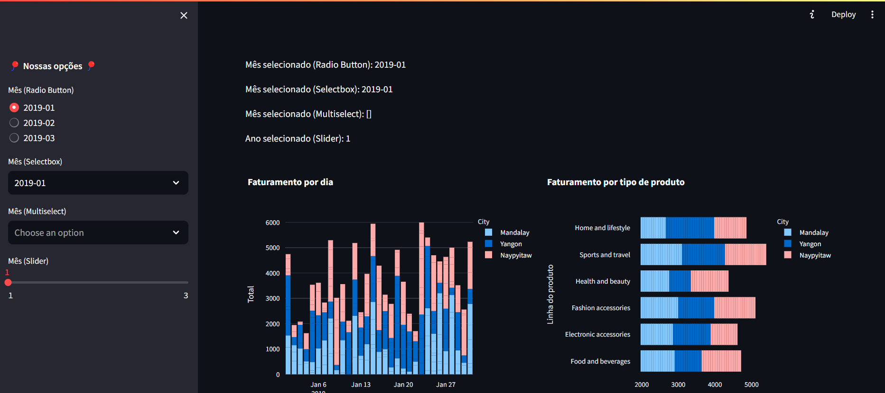
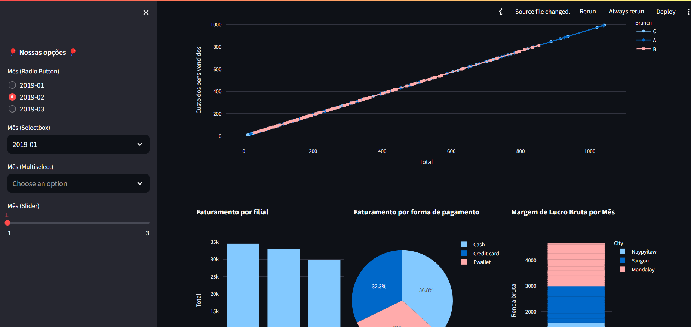
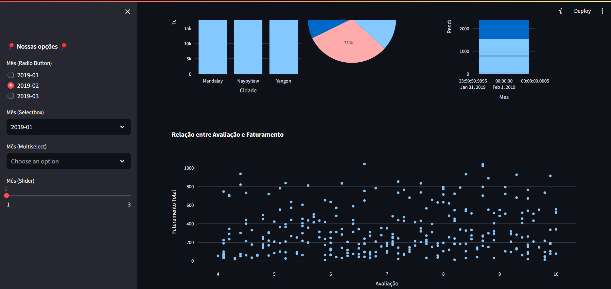
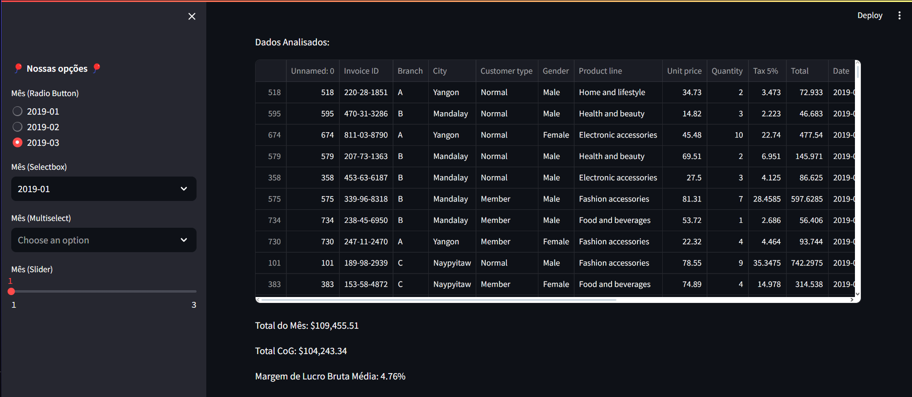

# Projeto Exemplo de Streamlit para Big Data

Este é um projeto de exemplo criado para demonstrar o uso do Streamlit em um contexto de Big Data. Foi desenvolvido para servir como material de apoio para estudantes de graduação na disciplina de Big Data.

## Descrição

Este projeto utiliza o Streamlit para criar uma aplicação web interativa que permite a seleção de um mês a partir de um conjunto de dados de vendas de supermercado. O objetivo é demonstrar como diferentes widgets do Streamlit podem ser utilizados para realizar seleções e como integrar esses widgets com um controlador para processar os dados e gerar visualizações.

## Funcionalidades

- Carregar dados de um arquivo CSV.
- Criar uma coluna adicional para o mês nos dados.
- Utilizar diferentes widgets do Streamlit para seleção de mês:
  - Radio Button
  - Selectbox
  - Multiselect
  - Slider
- Exibir o mês selecionado para cada widget.
- Gerar visualizações interativas utilizando Plotly Express.
- Executar uma função de controle com base no mês selecionado.

## Estrutura do Projeto

```.
├── assets
│ └── supermarket_sales.csv
├── controller
│ └── controller.py
├── model
│ └── model.py
├── view
│ └── view.py
├── main.py
└── README.md
└── requirements.txt
```

- **assets/supermarket_sales.csv**: Arquivo CSV contendo os dados de vendas do supermercado.
- **controller/controller.py**: Contém a classe `ControladorSupermercado` que coordena as operações entre o modelo e a visualização.
- **model/model.py**: Contém a classe `ModeloSupermercado` que lida com o carregamento e processamento dos dados.
- **view/view.py**: Contém a classe `VisualizacaoSupermercado` que gera as visualizações dos dados.
- **app.py**: Script principal que executa a aplicação Streamlit.
- **README.md**: Documento explicativo do projeto.

## Instalação

1. Clone o repositório:

    ```bash
      git clone https://github.com/professorRaphael/ProjetoMercado.git
      cd ProjetoMercado
    ```

2. Crie um ambiente virtual e ative-o:

    python -m venv venv
    source venv/bin/activate  # No Windows, use `venv\Scripts\activate`

3. Instale as dependências:

    ```bash
    pip install -r requirements.txt
    ```

## Executando a Aplicação

1. Certifique-se de que o arquivo supermarket_sales.csv está no diretório assets.

2. Execute o script main.py com o Streamlit:

    ```python
    streamlit run main.py
    ```

3. Acesse a aplicação no seu navegador através do endereço indicado pelo Streamlit (geralmente <http://localhost:8501>).

## Exemplo de Uso

A aplicação apresenta uma barra lateral com diferentes widgets para seleção de mês. Os meses disponíveis são extraídos automaticamente do arquivo CSV carregado. Ao selecionar um mês usando qualquer um dos widgets, a aplicação exibe o mês selecionado e pode executar uma função de controle com base nessa seleção.

## Detalhes do Código

### Modelo (model/model.py)

O modelo é responsável por carregar e preparar os dados.

- Classe ModeloSupermercado:

  - `__init__(self, caminho_dados)`: Carrega os dados do CSV e converte a coluna de datas.

  - `criar_coluna_mes(self)`: Cria uma nova coluna representando o mês.

  - `obter_dados_por_mes(self, mes)`: Filtra os dados pelo mês selecionado.

  - `calcular_total_do_mes(self, mes, coluna_alvo="Total")`: Calcula o total de vendas do mês.

  - `calcular_total_cogs(self, mes)`: Calcula o custo dos bens vendidos no mês.

  - `calcular_margem_de_lucro_bruta(self, mes)`: Calcula a margem de lucro bruta do mês.

### Visualização (view/view.py)

A visualização é responsável por gerar gráficos interativos.

- Classe VisualizacaoSupermercado:

  - `exibir_pagina(self, df_filtrado, total_do_mes, margem_de_lucro_bruta, calcular_total_cogs)`: Gera e exibe os gráficos interativos usando Plotly Express.

### Controlador (controller/controller.py)

O controlador coordena as interações entre o modelo e a visualização.

- Classe ControladorSupermercado:

  - `__init__(self, caminho_dados)`: Inicializa o modelo e a visualização.

  - `executar(self, mes)`: Executa as operações necessárias para o mês selecionado, incluindo cálculos e geração de gráficos.

### Aplicação (main.py)

O script principal que configura e executa a aplicação Streamlit.

## Carrega os dados

- Carrega os dados.
- Configura a barra lateral com os widgets para seleção de mês.
- Exibe os resultados e gráficos baseados na seleção do usuário.

## Contribuição

- Contribuições são bem-vindas! Sinta-se à vontade para abrir issues ou pull requests.

## ScreenShot








